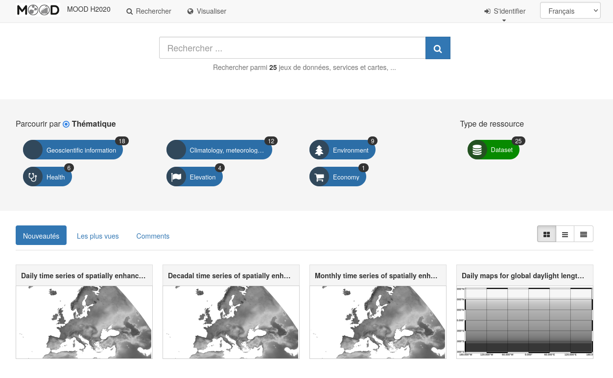
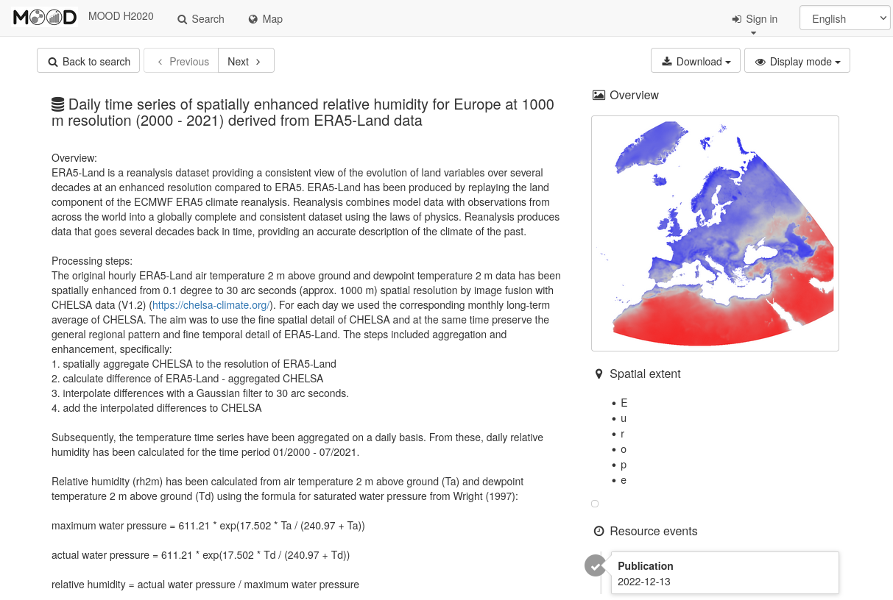

# Insert metadata into MOOD GeoNetwork

Automatic insertion of dataset descriptions from a spreadsheet into [MOOD GeoNetwork](https://geonetwork.mood-h2020.eu/geonetwork/).

This repository contains a [R script](addMetadataToGN.R) that parses a [CSV file](params/datasets.csv) and generate [ISO19115 XML files](xml_generated) for each dataset and [log errors](logs) in the csv file.

| | |
|---------------|--------------------|
| |  |


## Goals and overview 
The aim of this project is to :

1. Parse data from [the XLS shared](https://docs.google.com/spreadsheets/d/1_P01ZPObmbhMymaVDM547Rr2RIrw-gGX/edit#gid=699786557)
2. Create metadata files for all the datasets produced or used by the project
3. Upload it trough GeoNetwork API to [MOOD GeoNetwork](https://geonetwork.mood-h2020.eu/geonetwork/)

```shell
├── addMetadataToGN.R # main script
├── params
│   └── datasets.csv # the csv file containing all the Metadata
├── xml_generated # Directory containing the ISO19115 files
    ├── An_annotated_Avian_Influenza_dataset_from_two_event-based_surveillance_systems.xml
    ├── Annotated_datasets_from_PADI-web_for_event-based_surveillance_of_Avian_Influenza,_African_Swine_Fever,_and_West-Nile_Virus_Disease.xml
    ├── [...]
├── logs # Directory containing all the errors and warning output from the csv file parsing
│   ├── csv_error_20231114_123101.csv
│   └── csv_error_20231114_123151.csv
├── README.md
└── LICENSE

```

## Usage

### 1. Manual prerequisites
The XLS file shared has to be formatted to make it easy to parse it. Here are the actions:

1. Export a csv file
2. Remove the 2 first rows (header)
3. Remove lines corresponding to Mundialis since their datasets are already harvested from their GeoNetwork
4. Add **n**, and **UUID** Columns

### 2. Building the R execution environment
* Dependencies System libs:

```shell
sudo apt-get install libssl-dev libxml2-dev
```
* Dependencies System lib related to R software:

```shell
sudo apt-key adv --keyserver keyserver.ubuntu.com --recv-keys E298A3A825C0D65DFD57CBB651716619E084DAB9
sudo add-apt-repository 'deb [arch=amd64,i386] https://cran.rstudio.com/bin/linux/ubuntu xenial/'
sudo apt-get install r-base
```
* R addiotional libs:
	(see https://github.com/eblondel/geonapi/wiki#install_guide, https://github.com/eblondel/geometa/wiki#install_guide)

```R
install.packages("devtools")
install.packages("XML")
install.packages("uuid")
require("devtools")
install_github("eblondel/geometa")
```

### 3. Executing the R script
```shell
Rscript addMetadataToGN.R
```


## Acknowledgement
+ geometa : R librairy to create iso 19115 xml (inspire compliant) : https://github.com/eblondel/geometa

## License
This code is provided under the [CeCILL-B](https://cecill.info/licences/Licence_CeCILL-B_V1-en.html) free software license agreement.
